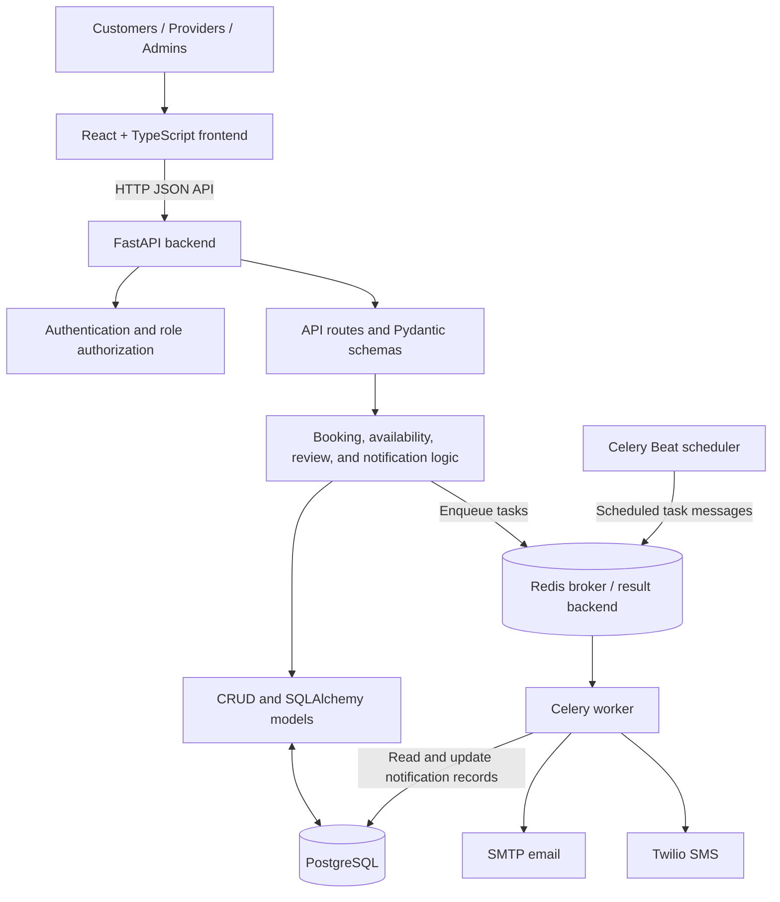

# Appointment & Resource Booking System

A full-stack system for browsing services, booking appointments with people or reservable resources, and managing provider schedules.

## Overview & Architecture

### 1. Project Overview

Customers can browse active services and providers, check availability, and book an appointment with a selected provider or resource. Registered users can manage their appointments, and customers can review eligible person providers after completed appointments. Providers manage their schedules and service offerings, while administrators manage services and providers and review appointment records.

The backend provides authentication and role-based authorization, calculates available slots, validates bookings, and handles appointment lifecycle operations. Confirmation, reminder, cancellation, rescheduling, and feedback-request notifications are processed through the notification task infrastructure. Email uses SMTP and SMS uses Twilio when configured.

### 2. Key Features

#### Customer

- Sign up, log in, restore an authenticated session, and request a password reset.
- Browse active services and providers, then select a service, provider, date, and available slot.
- Book an appointment and view upcoming, past, and cancelled appointments in My Appointments.
- Cancel or reschedule appointments subject to backend validation and cancellation rules.
- Submit or edit a 1-5 star rating and optional comment for an eligible completed appointment.

#### Service Provider

- Access provider-specific dashboard, appointment, and calendar pages.
- Manage weekly availability, recurring breaks, date-specific blackout periods, and service offerings.
- Update provider profile and availability status.

#### Admin

- View appointment and service/provider counts and appointment status totals on the dashboard.
- Create and update services, and assign providers to services.
- Create and update person or resource provider records and their service associations.
- Search, filter, and page through appointments; view provider schedules.
- See provider rating averages and review counts where ratings exist.

#### System

- Enforce user roles in backend endpoints; frontend routes also gate customer, provider, and admin pages.
- Persist application data in PostgreSQL through SQLAlchemy, with schema changes managed by Alembic.
- Calculate slots from provider working windows, service duration and buffer, breaks, blackouts, and existing appointments.
- Store appointment instants as timezone-aware UTC values and convert using provider or requested IANA timezones.
- Queue notification and appointment lifecycle tasks with Celery and Redis.
- Expose the FastAPI OpenAPI schema and interactive API documentation.
- Include booking conflict checks and double-booking prevention in the booking service.

### 3. Main Use Cases

#### Customer books an appointment

1. The customer browses services and chooses one to book.
2. The booking flow loads available slots for a date range, optionally filtered by provider.
3. The customer chooses a provider and slot, enters booking details, reviews the booking, and confirms.
4. The backend verifies that the service is active and offered by the available provider, revalidates the slot, and creates the appointment.
5. The appointment appears in My Appointments for an authenticated customer. A booking confirmation and future reminders are scheduled through the notification tasks.

#### Customer reviews a completed appointment

1. The appointment is completed and appears in the customer's past appointments.
2. The customer opens the review action and submits a 1-5 rating with an optional comment.
3. The backend checks appointment ownership, completion status, and provider type, and permits one review per appointment.
4. The review is stored against the appointment, customer, and provider. Provider averages and counts are computed from persisted reviews when provider data is queried.

#### Admin manages services and providers

1. An administrator opens service or provider management.
2. Services can be created or updated and associated with providers. Provider records can be created or updated, including type, profile information, availability status, and service associations.
3. Providers and administrators can manage provider schedule details through provider endpoints; the admin dashboard also exposes provider schedules and appointment lists.

#### Customer changes an appointment

From My Appointments, the customer can request cancellation or rescheduling for an upcoming appointment. The backend validates eligibility, schedule conflicts, and applicable cancellation rules before saving the change and enqueueing the relevant notification.

### 4. System Architecture



Redis is configured as both the Celery broker and result backend. The API enqueues background notification work; Celery workers deliver configured email or SMS notifications. Celery Beat also schedules the periodic task that completes expired appointments.

### 5. Backend Architecture

The backend code is under `backend/app/`:

- `api/routes/` defines FastAPI endpoints for authentication, services, providers, availability, appointments, reviews, administration, password reset, terms, and uploads.
- `schemas/` contains Pydantic request and response models used at the API boundary.
- `services/` contains business operations for booking, availability calculation, reviews, and notifications.
- `crud/` contains data-access operations for services, providers, provider-service links, breaks, and provider rating queries.
- `models/` defines SQLAlchemy entities, including users, services, providers, provider availability, appointments, cancellations, reviews, and notifications.
- `db/database.py` configures the SQLAlchemy engine, session factory, declarative base, and request-scoped database dependency.
- `core/security.py` implements password hashing, signed access tokens, current-user resolution, and role checks. `core/timezones.py` provides timezone conversion helpers; `core/config.py` loads settings.
- `tasks/` defines Celery notification and appointment tasks; `celery_app.py` configures the Celery application, Redis connections, and scheduled tasks.
- `alembic/` contains database migration configuration and revision scripts.

### 6. Frontend Architecture

The frontend is a React, TypeScript, and Vite application under `frontend/src/`:

- `main.tsx` mounts the app inside React Router; `App.tsx` loads the route tree.
- `routes/AppRoutes.tsx` defines routes and client-side protected, provider, and admin route wrappers.
- `auth/` contains the authentication context and hook. The context stores the access token and user profile in `sessionStorage` and refreshes the current profile through the API.
- `pages/` contains customer-facing service, provider, booking, appointment, profile, and authentication pages, along with provider and admin pages.
- `components/` contains shared layout/navigation and reusable workflows, including appointment reviews and rescheduling.
- `lib/` contains API helpers for customer appointments, admin appointments, and providers. Other pages call the backend with `fetch` directly.
- `index.css` provides the shared application styling. Vite proxies `/api` requests to the local FastAPI server during development.

Client-side route guards improve navigation behavior; the backend remains responsible for authorization.

### 7. Technology Stack

| Layer | Technology | Purpose |
|---|---|---|
| Frontend | React, TypeScript, Vite, React Router | Single-page application, type checking, development/build tooling, and routing |
| Backend | Python, FastAPI, Pydantic | HTTP API, request validation, and response serialization |
| Database | PostgreSQL, psycopg | Relational persistence and PostgreSQL connectivity |
| ORM | SQLAlchemy | Database models, queries, and sessions |
| Migrations | Alembic | Versioned database schema changes |
| Task queue | Celery | Background notification and appointment tasks |
| Message broker / result backend | Redis | Celery task transport and result storage |
| API docs | FastAPI OpenAPI / Swagger UI | Generated API schema and interactive documentation |
| Container / infrastructure | Docker (backend `Dockerfile`) | Build and run the backend container image |
| Tests | Pytest | Backend test suite |

### 8. Architecture Notes

- The booking service verifies the selected service-provider relationship and provider availability, locks the provider row during booking, and checks for overlapping appointments before creating a booking.
- Availability is calculated from the provider's weekly working windows, service duration and buffer, recurring breaks, date-specific blackouts, and non-cancelled appointments. Booking validation independently rechecks the slot.
- Appointment start and end values are stored as timezone-aware UTC instants. Provider schedule calculations use the provider's configured timezone, and API responses convert to the requested timezone where applicable.
- Provider ratings are query-time averages and counts over persisted reviews. Reviews require a completed appointment owned by the customer; only providers with type `PERSON` are reviewable, not `RESOURCE` providers.
- Role checks are enforced by backend dependencies on protected endpoints. Frontend route wrappers are not a substitute for those server-side checks.
- Notification delivery depends on configured SMTP or Twilio settings. Celery tasks retry selected delivery failures; the repository does not include a Docker Compose deployment definition.

## Project Structure

```text
appointment-booking-system/
├── backend/
│   ├── app/          # FastAPI application, models, services, and tasks
│   ├── alembic/      # Database migrations
│   └── tests/        # Backend tests
├── frontend/
│   └── src/          # React application
└── README.md
```
