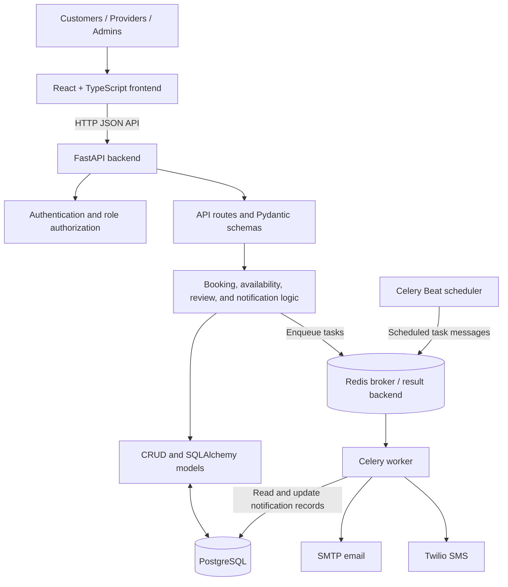
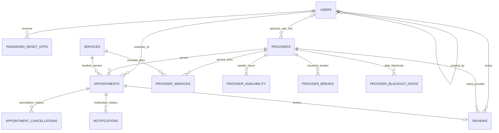

# Appointment & Resource Booking System

A full-stack system for browsing services, booking appointments with people or reservable resources, and managing provider schedules.

## Overview & Architecture

### 1. Project Overview

Customers can browse active services and providers, check availability, and book an appointment with a selected provider or resource. Registered users can manage their appointments, and customers can review eligible person providers after completed appointments. Providers manage their schedules and service offerings, while administrators manage services and providers and review appointment records.

The backend provides authentication and role-based authorization, calculates available slots, validates bookings, and handles appointment lifecycle operations. Confirmation, reminder, cancellation, rescheduling, and feedback-request notifications are processed through the notification task infrastructure. Email uses SMTP and SMS uses Twilio when configured.

### 2. Key Features

#### Customer

- Sign up, log in, restore an authenticated session, and request a password reset.
- Browse active services and providers, then select a service, provider, date, and available slot.
- Book an appointment and view upcoming, past, and cancelled appointments in My Appointments.
- Cancel or reschedule appointments subject to backend validation and cancellation rules.
- Submit or edit a 1-5 star rating and optional comment for an eligible completed appointment.

#### Service Provider

- Access provider-specific dashboard, appointment, and calendar pages.
- Manage weekly availability, recurring breaks, date-specific blackout periods, and service offerings.
- Update provider profile and availability status.

#### Admin

- View appointment and service/provider counts and appointment status totals on the dashboard.
- Create and update services, and assign providers to services.
- Create and update person or resource provider records and their service associations.
- Search, filter, and page through appointments; view provider schedules.
- See provider rating averages and review counts where ratings exist.

#### System

- Enforce user roles in backend endpoints; frontend routes also gate customer, provider, and admin pages.
- Persist application data in PostgreSQL through SQLAlchemy, with schema changes managed by Alembic.
- Calculate slots from provider working windows, service duration and buffer, breaks, blackouts, and existing appointments.
- Store appointment instants as timezone-aware UTC values and convert using provider or requested IANA timezones.
- Queue notification and appointment lifecycle tasks with Celery and Redis.
- Expose the FastAPI OpenAPI schema and interactive API documentation.
- Include booking conflict checks and double-booking prevention in the booking service.

### 3. Main Use Cases

#### Customer books an appointment

1. The customer browses services and chooses one to book.
2. The booking flow loads available slots for a date range, optionally filtered by provider.
3. The customer chooses a provider and slot, enters booking details, reviews the booking, and confirms.
4. The backend verifies that the service is active and offered by the available provider, revalidates the slot, and creates the appointment.
5. The appointment appears in My Appointments for an authenticated customer. A booking confirmation and future reminders are scheduled through the notification tasks.

#### Customer reviews a completed appointment

1. The appointment is completed and appears in the customer's past appointments.
2. The customer opens the review action and submits a 1-5 rating with an optional comment.
3. The backend checks appointment ownership, completion status, and provider type, and permits one review per appointment.
4. The review is stored against the appointment, customer, and provider. Provider averages and counts are computed from persisted reviews when provider data is queried.

#### Admin manages services and providers

1. An administrator opens service or provider management.
2. Services can be created or updated and associated with providers. Provider records can be created or updated, including type, profile information, availability status, and service associations.
3. Providers and administrators can manage provider schedule details through provider endpoints; the admin dashboard also exposes provider schedules and appointment lists.

#### Customer changes an appointment

From My Appointments, the customer can request cancellation or rescheduling for an upcoming appointment. The backend validates eligibility, schedule conflicts, and applicable cancellation rules before saving the change and enqueueing the relevant notification.

### 4. System Architecture



Redis is configured as both the Celery broker and result backend. The API enqueues background notification work; Celery workers deliver configured email or SMS notifications. Celery Beat also schedules the periodic task that completes expired appointments.

### 5. Backend Architecture

The backend code is under `backend/app/`:

- `api/routes/` defines FastAPI endpoints for authentication, services, providers, availability, appointments, reviews, administration, password reset, terms, and uploads.
- `schemas/` contains Pydantic request and response models used at the API boundary.
- `services/` contains business operations for booking, availability calculation, reviews, and notifications.
- `crud/` contains data-access operations for services, providers, provider-service links, breaks, and provider rating queries.
- `models/` defines SQLAlchemy entities, including users, services, providers, provider availability, appointments, cancellations, reviews, and notifications.
- `db/database.py` configures the SQLAlchemy engine, session factory, declarative base, and request-scoped database dependency.
- `core/security.py` implements password hashing, signed access tokens, current-user resolution, and role checks. `core/timezones.py` provides timezone conversion helpers; `core/config.py` loads settings.
- `tasks/` defines Celery notification and appointment tasks; `celery_app.py` configures the Celery application, Redis connections, and scheduled tasks.
- `alembic/` contains database migration configuration and revision scripts.

### 6. Frontend Architecture

The frontend is a React, TypeScript, and Vite application under `frontend/src/`:

- `main.tsx` mounts the app inside React Router; `App.tsx` loads the route tree.
- `routes/AppRoutes.tsx` defines routes and client-side protected, provider, and admin route wrappers.
- `auth/` contains the authentication context and hook. The context stores the access token and user profile in `sessionStorage` and refreshes the current profile through the API.
- `pages/` contains customer-facing service, provider, booking, appointment, profile, and authentication pages, along with provider and admin pages.
- `components/` contains shared layout/navigation and reusable workflows, including appointment reviews and rescheduling.
- `lib/` contains API helpers for customer appointments, admin appointments, and providers. Other pages call the backend with `fetch` directly.
- `index.css` provides the shared application styling. Vite proxies `/api` requests to the local FastAPI server during development.

Client-side route guards improve navigation behavior; the backend remains responsible for authorization.

### 7. Technology Stack

| Layer | Technology | Purpose |
|---|---|---|
| Frontend | React, TypeScript, Vite, React Router | Single-page application, type checking, development/build tooling, and routing |
| Backend | Python, FastAPI, Pydantic | HTTP API, request validation, and response serialization |
| Database | PostgreSQL, psycopg | Relational persistence and PostgreSQL connectivity |
| ORM | SQLAlchemy | Database models, queries, and sessions |
| Migrations | Alembic | Versioned database schema changes |
| Task queue | Celery | Background notification and appointment tasks |
| Message broker / result backend | Redis | Celery task transport and result storage |
| API docs | FastAPI OpenAPI / Swagger UI | Generated API schema and interactive documentation |
| Container / infrastructure | Docker (backend `Dockerfile`) | Build and run the backend container image |
| Tests | Pytest | Backend test suite |

### 8. Architecture Notes

- The booking service verifies the selected service-provider relationship and provider availability, locks the provider row during booking, and checks for overlapping appointments before creating a booking.
- Availability is calculated from the provider's weekly working windows, service duration and buffer, recurring breaks, date-specific blackouts, and non-cancelled appointments. Booking validation independently rechecks the slot.
- Appointment start and end values are stored as timezone-aware UTC instants. Provider schedule calculations use the provider's configured timezone, and API responses convert to the requested timezone where applicable.
- Provider ratings are query-time averages and counts over persisted reviews. Reviews require a completed appointment owned by the customer; only providers with type `PERSON` are reviewable, not `RESOURCE` providers.
- Role checks are enforced by backend dependencies on protected endpoints. Frontend route wrappers are not a substitute for those server-side checks.
- Notification delivery depends on configured SMTP or Twilio settings. Celery tasks retry selected delivery failures; the repository does not include a Docker Compose deployment definition.

## Database Design & Key Algorithms

### Database Overview

PostgreSQL is the primary relational database. SQLAlchemy models define the current schema, and Alembic revisions evolve it. `Customer` is a compatibility alias for `User`; there is no separate customers table in the current model.

| Entity | Purpose and relationships |
|---|---|
| `User` | Login identity and role. May be linked to appointments and reviews, and is referenced by password-reset records. A provider profile can optionally reference a user. |
| `Service` | Bookable offering with duration, optional price, capacity, buffer, and active status. Appointments reference a service; providers offer services through `ProviderService`. |
| `Provider` | Person or resource that can be booked. Owns schedule, break, blackout, service-link, and review records; appointments reference one provider. It may optionally reference a `User`. |
| `ProviderService` | Association between one provider and one service, with an active flag. This is the persisted many-to-many link used when deciding which provider can offer a service. |
| `ProviderAvailability` | Recurring weekly working window, keyed to a provider and weekday. |
| `ProviderBreak` | Recurring weekly unavailable interval for a provider. |
| `ProviderBlackoutDate` | Date-specific unavailable interval, with optional reason and all-day flag. |
| `Appointment` | Reservation for a service and provider, with contact details, time interval, status, and an optional link to the registered customer. The contact fields remain on the appointment record. |
| `AppointmentCancellation` | Cancellation history for an appointment, including actor, optional reason, and refund status. An appointment can have multiple cancellation records. |
| `Review` | A customer's rating/comment for a provider tied to one appointment. The appointment ID is unique in this table. |
| `Notification` | Delivery status and recipient for an appointment-related email or SMS. |
| `PasswordResetOtp` | Hashed, expiring, single-use password-reset codes associated with a user. |

### Entity Relationship Diagram

The diagram follows the model foreign keys. `o|` indicates an optional relationship; appointments may have no linked user for guest bookings. A provider's optional user foreign key is not unique in the database.



### Schema Design

- Core entities use UUID primary keys and explicit foreign keys. Nullable `appointments.customer_id` supports appointments without a linked account; the appointment still stores the supplied contact details.
- `ProviderService` implements the provider/service many-to-many relationship. Its unique `(provider_id, service_id)` constraint prevents duplicate links while `is_active` can deactivate an association without deleting it.
- Role, service, provider type/status, appointment status, cancellation refund status, and notification type/status use enums.
- User email is unique. A review has a unique appointment foreign key and a database check requiring `rating` from 1 through 5. The service also checks ownership, completed status, and provider type before insertion.
- Appointment checks require the end to follow the start and duration to be positive. The confirmation token is unique. Indexes support common appointment lookups by provider/start, status/start, customer, and contact email.
- Time columns use timezone-aware database types. Service prices use `Numeric(10, 2)` rather than floating-point storage.

### Availability Algorithm

`GET /api/availability/slots` calculates candidate starts over an inclusive date range. The endpoint accepts an optional service and provider filter, a page number, and a slot interval (default 15 minutes, allowed from 1 to 120); it caps the date range at 31 days and returns 20 slots per page.

For each active service and matching active provider-service link, the calculation:

1. Keeps providers whose status is `AVAILABLE`, then applies the optional provider filter.
2. Converts the requested date's provider-local weekly working windows to UTC intervals using the provider's IANA timezone.
3. Subtracts recurring breaks, intersecting date-specific blackout intervals, and non-cancelled appointments from those windows.
4. Generates candidate starts at the requested slot interval. A candidate must fit the service duration plus that service's buffer and must be in the future.
5. Returns slot start/end instants and provider/service details. The end is the service duration after the start; the buffer is not part of the returned appointment interval.

The service buffer is used when finding displayed slots. In the current calculation it is also added after each existing appointment while subtracting busy time. Appointment creation and rescheduling separately check actual appointment overlap, working hours, breaks, and blackouts.

### Concurrency Strategy

The booking service selects the provider `FOR UPDATE`, validates provider/service availability and overlapping non-cancelled appointments in the same SQLAlchemy transaction, inserts the appointment, and commits before it queues notifications. Rescheduling and cancellation also lock records; slot conflicts return an application-level conflict.

There is no database exclusion constraint for overlapping appointment intervals. The provider row lock serializes concurrent writes that use the booking service, and `backend/tests/test_booking_concurrency.py` exercises ten concurrent attempts and expects one success. Direct database writes or future code paths that bypass the lock and validation are not protected by an interval constraint.

### Provider Ratings

Reviews reference an appointment, customer, and provider. The review service permits creation only by the appointment's customer after the appointment is `COMPLETED`, and only when the provider type is `PERSON`. The database permits one review row per appointment and enforces the 1-5 range; an existing review can be edited by its customer.

Provider average and count are query-time aggregates over persisted reviews, with averages rounded to two decimal places. The aggregate query filters to `PERSON`, so `RESOURCE` providers are not rated or included in rating results.

## Setup & API Documentation

### Prerequisites

- Python 3.11 or newer, as declared in `backend/pyproject.toml`.
- Node.js and npm. The repository does not pin a Node.js version.
- PostgreSQL, required by the configured PostgreSQL driver and model types.
- Redis when running Celery workers and scheduled tasks. The settings default to a local Redis service.
- SMTP and/or Twilio credentials only when using those delivery channels.
- Docker is optional; the repository contains a backend Dockerfile but no Compose file.

### Repository Structure

```text
appointment-booking-system/
├── backend/
│   ├── app/              # FastAPI routes, models, services, CRUD, and tasks
│   ├── alembic/          # Alembic configuration and revisions
│   ├── scripts/          # Admin bootstrap and sample-data seed scripts
│   ├── tests/            # Backend tests
│   ├── pyproject.toml
│   └── Dockerfile
├── frontend/
│   ├── src/              # React application
│   ├── package.json
│   └── vite.config.ts
└── README.md
```

### Environment Variables

Backend settings are loaded case-insensitively from environment variables and `.env` in the backend process's working directory. `DATABASE_URL` is the only setting with no default. No backend `.env.example` is provided; create a local `backend/.env` and do not commit credentials.

| Group | Variable | Requirement/default | Purpose |
|---|---|---|---|
| Database | `DATABASE_URL` | Required | SQLAlchemy PostgreSQL connection URL; the configured driver is psycopg. |
| Application | `APP_NAME` | Optional; code default | FastAPI title and account email text. |
| Application | `ENVIRONMENT` | Optional; defaults to `development` | Environment label returned by the health endpoint. |
| Application | `DEBUG` | Optional; defaults to `true` | FastAPI debug setting. |
| Authentication | `AUTH_SECRET` | Optional; code contains a placeholder default | HMAC signing key for access and password-reset tokens. Set a private value rather than relying on the placeholder. |
| Authentication | `AUTH_TOKEN_EXPIRY_SECONDS` | Optional; defaults to 604800 | Access-token lifetime in seconds. |
| Booking | `CANCELLATION_GRACE_PERIOD_MINUTES` | Optional; defaults to 60 | Minimum time before appointment start for cancellation. |
| Notifications | `FEEDBACK_DELAY_MINUTES` | Optional; defaults to 15 | Delay after appointment end before the feedback task is scheduled. |
| Redis/Celery | `REDIS_URL` | Optional; defaults to `redis://localhost:6379/0` | Celery broker URL. |
| Redis/Celery | `CELERY_RESULT_BACKEND` | Optional; defaults to `redis://localhost:6379/1` | Celery result backend URL. |
| Email | `SMTP_HOST` | Optional; no default | SMTP host. Email delivery also requires `SMTP_FROM`. |
| Email | `SMTP_PORT` | Optional; defaults to 587 | SMTP port. |
| Email | `SMTP_FROM` | Optional; no default | Sender address; required by the email delivery function. |
| Email | `SMTP_USERNAME`, `SMTP_PASSWORD` | Optional | SMTP authentication when the server requires it. |
| Email | `SMTP_STARTTLS` | Optional; defaults to `true` | Whether to start TLS for SMTP. |
| SMS | `TWILIO_ACCOUNT_SID`, `TWILIO_AUTH_TOKEN`, `TWILIO_FROM_PHONE` | Optional; no defaults | Twilio account, credential, and sending number used for SMS delivery. |
| Admin bootstrap | `INITIAL_ADMIN_EMAIL`, `INITIAL_ADMIN_PASSWORD` | Optional; read by `scripts/seed_admin.py`, not by application settings | Initial admin credentials. Set these in the process environment before running the bootstrap script; it has built-in fallbacks if they are omitted. |

For example, the minimum backend `.env` needs a `DATABASE_URL` in SQLAlchemy's PostgreSQL/psycopg URL form, such as `postgresql+psycopg://<user>:<password>@localhost:5432/<database>`. Redis URLs can be omitted when using the code defaults. Configure `AUTH_SECRET` and delivery settings explicitly as needed.

The current Vite app does not read a frontend API URL variable: `frontend/vite.config.ts` proxies `/api` to `http://localhost:8000`. The checked-in `frontend/.env.example` contains legacy template values, including a Next.js-style API URL, and is not used by this application.

### Backend Setup

Run these commands from the repository root in PowerShell:

```powershell
cd backend
python --version  # Use Python 3.11 or newer.
python -m venv .venv
.\.venv\Scripts\Activate.ps1
python -m pip install -e ".[dev]"
```

Create `backend/.env` with at least `DATABASE_URL`, then run migrations and start the API from the `backend/` directory:

```powershell
alembic upgrade head
python -m uvicorn app.main:app --reload
```

To create an initial administrator, set `INITIAL_ADMIN_EMAIL` and `INITIAL_ADMIN_PASSWORD` in the PowerShell process before running the script. It skips creation if an admin already exists.

```powershell
$env:INITIAL_ADMIN_EMAIL = "admin@example.test"
$env:INITIAL_ADMIN_PASSWORD = "replace-with-a-unique-password"
python scripts/seed_admin.py
```

The script has built-in fallback credentials if these variables are omitted, so set them explicitly. `python scripts/seed_data.py` loads sample records but deletes existing appointment, provider, service, user, and related schedule/notification rows first; use it only against a disposable development database.

### Frontend Setup

From another terminal:

```powershell
cd frontend
npm install
npm run dev
```

`npm run build` runs the TypeScript project build and Vite production build. `npm run lint` runs ESLint. The Vite development proxy expects the backend at `http://localhost:8000`; there is no configured frontend API-base environment variable.

### PostgreSQL / Redis / Celery

Start PostgreSQL with a database matching `DATABASE_URL` and Redis reachable at `REDIS_URL`. The repository does not include scripts or Compose configuration to provision either service. Redis is both Celery's broker and result backend (separate database numbers by default).

The repository does not wrap worker startup in a script. With the backend environment active and the current directory set to `backend/`, run the worker and Beat scheduler in separate terminals:

```powershell
celery -A app.celery_app:celery_app worker --loglevel=info
celery -A app.celery_app:celery_app beat --loglevel=info
```

The worker runs queued tasks; Celery Beat publishes the configured expired-appointment completion task every 60 seconds. Email delivery requires SMTP settings; SMS delivery requires the Twilio settings.

### API Documentation

With the backend running at its default local address, FastAPI's default documentation routes are enabled:

- Swagger UI: `http://localhost:8000/docs`
- ReDoc: `http://localhost:8000/redoc`
- OpenAPI JSON: `http://localhost:8000/openapi.json`

The main API routes are:

#### Authentication

| Method | Endpoint | Purpose |
|---|---|---|
| POST | `/api/auth/signup` | Register a customer account. |
| POST | `/api/auth/login` | Authenticate and return an access token. |
| GET, PATCH | `/api/auth/me` | Read or update the authenticated user's profile. |
| POST | `/api/password-reset/request` | Request a password-reset code. |
| POST | `/api/password-reset/verify` | Verify the reset code and obtain a reset token. |
| POST | `/api/password-reset/confirm` | Set a new password using the reset token. |

#### Services

| Method | Endpoint | Purpose |
|---|---|---|
| GET, POST | `/api/services` | List services or create a service (creation is admin-protected). |
| GET, PUT | `/api/services/{service_id}` | Read or update a service (update is admin-protected). |
| GET | `/api/services/admin-with-providers` | List services with associated providers (admin). |
| GET, POST | `/api/services/{service_id}/providers` | Read or assign providers for a service (admin). |

#### Providers

| Method | Endpoint | Purpose |
|---|---|---|
| GET, POST | `/api/providers` | List providers or create a provider. |
| PUT | `/api/providers/{provider_id}` | Update a provider. |
| GET, PUT | `/api/providers/{provider_id}/services` | Read or update provider service links. |
| GET, PUT | `/api/providers/{provider_id}/schedule/weekly` | Read or replace the weekly schedule. |
| PUT | `/api/providers/{provider_id}/schedule/weekly/{day_of_week}` | Update one weekday schedule. |
| POST | `/api/providers/{provider_id}/availability` | Replace provider availability windows. |
| GET, POST | `/api/providers/{provider_id}/breaks` | List or add recurring breaks. |
| PUT, DELETE | `/api/providers/{provider_id}/breaks/{break_id}` | Update or remove a break. |
| GET, POST | `/api/providers/{provider_id}/unavailability` | Read or add blackout intervals. |
| DELETE | `/api/providers/{provider_id}/unavailability/{blackout_id}` | Remove a blackout interval. |
| GET | `/api/providers/{provider_id}/schedule` | Read a provider schedule, optionally for a date. |

#### Availability

| Method | Endpoint | Purpose |
|---|---|---|
| GET | `/api/availability/slots` | Calculate and page available slots by date range, optionally service/provider filtered. |

#### Appointments

| Method | Endpoint | Purpose |
|---|---|---|
| POST, GET | `/api/appointments` | Create an appointment or list appointment records. |
| GET, PUT, DELETE | `/api/appointments/{appointment_id}` | Read, update, or cancel an appointment. |
| POST | `/api/appointments/{appointment_id}/cancel` | Cancel an appointment and record cancellation details. |
| POST | `/api/appointments/{appointment_id}/reschedule` | Reschedule an appointment. |
| GET | `/api/appointments/{appointment_id}/cancellations` | Read cancellation history. |
| GET | `/api/customer/appointments` | List the authenticated user's appointments. |
| GET | `/api/customer/appointments/{appointment_id}` | Read an owned appointment. |
| POST | `/api/customer/appointments/{appointment_id}/cancel` | Cancel an owned appointment. |
| POST | `/api/customer/appointments/{appointment_id}/reschedule` | Reschedule an owned appointment. |

#### Reviews

| Method | Endpoint | Purpose |
|---|---|---|
| POST | `/api/reviews` | Create a review for an eligible completed appointment. |
| GET | `/api/reviews/appointment/{appointment_id}` | Read the current user's review for an appointment. |
| PUT | `/api/reviews/{review_id}` | Update the current user's review. |

#### Admin

| Method | Endpoint | Purpose |
|---|---|---|
| GET | `/api/admin/overview` | Read dashboard counts and appointment status totals. |
| GET | `/api/admin/appointments` | Search, filter, and page through appointments. |
| GET | `/api/admin/providers/{provider_id}/schedule` | Read a provider schedule and appointments in a date range. |
| POST | `/api/admin/users` | Create a user account (admin). |

Notification delivery is handled by internal tasks; there is no public notification API router in the current application.

### Running the Full System

1. Start PostgreSQL and Redis using local installations or your own infrastructure; no repository Compose setup is provided.
2. Configure `backend/.env`, create/activate the backend virtual environment, install dependencies, and run `alembic upgrade head` as above.
3. Optionally create an administrator with `scripts/seed_admin.py`; use `scripts/seed_data.py` only for a disposable database.
4. Start FastAPI, plus a Celery worker and Beat scheduler in separate backend terminals if background tasks are required.
5. Install frontend dependencies and run `npm run dev`. The Vite proxy sends `/api` requests to the local backend.

## Design Decisions & Limitations

### Technology Decisions

| Technology | Current role in this project |
|---|---|
| React, Vite, and React Router | Render the TypeScript single-page app, route between role-specific pages, and proxy `/api` during local development. |
| TypeScript | Types the frontend pages, context, and API data; the configured build runs `tsc -b`. |
| FastAPI and Pydantic | Define HTTP routes, validate request/response models, and generate OpenAPI documentation. |
| SQLAlchemy and PostgreSQL | Map relational entities and foreign keys to PostgreSQL; models also use PostgreSQL UUID and array types. |
| Alembic | Keep schema evolution in ordered migration revisions. |
| Celery and Redis | Queue booking-related notification work and run the configured periodic appointment-completion task. |
| Global CSS | `frontend/src/index.css` contains shared styling and font imports; no separate styling framework is listed as a dependency. |

### Authentication & Authorization

The persisted roles are `CUSTOMER`, `PROVIDER`, and `ADMIN`. `SERVICE_PROVIDER` is accepted as an alias and normalizes to `PROVIDER`. Passwords are hashed with PBKDF2-HMAC-SHA256; bearer access and password-reset tokens are signed with HMAC and include expirations. This implementation does not use JWT.

Backend `require_role` dependencies enforce authorization on routes where they are applied. Frontend route guards only control client navigation and do not replace server checks. Route coverage is not uniform: the generic appointment read/update/cancel/reschedule routes under `/api/appointments` do not declare a role dependency, while `/api/customer/appointments` checks the authenticated role and appointment ownership. Several provider-management routes check that the caller is a provider or admin but do not verify that a provider caller owns the supplied `provider_id`; these are current authorization gaps to address before exposing the API to untrusted clients.

### Timezone Strategy

Appointment start/end values are stored as timezone-aware UTC instants. Provider schedules carry an IANA timezone and weekly local clock times; availability converts provider-local day boundaries and working windows to UTC. API response helpers convert times to the requested timezone. `ZoneInfo` handles daylight-saving transitions, and `backend/tests/test_timezones.py` covers UTC/local conversion and winter/summer offsets for New York.

Keeping instants in UTC allows overlap checks across providers and clients in different timezones; local schedule rules remain expressed in each provider's timezone. Tests cover conversion behavior, not every ambiguous/nonexistent local-time edge case around DST changes.

### Provider vs Resource Design

People and bookable resources share the `Provider` model and are distinguished by the `PERSON` or `RESOURCE` type. Both types can be associated with services and participate in availability and booking. Reviews and provider rating aggregation explicitly require/filter to `PERSON`; resources do not receive ratings.

### Notification Architecture

Booking-related notifications are queued after the appointment transaction commits. The API publishes tasks through Celery to Redis; workers read appointment data, persist notification outcomes, and send email through SMTP or SMS through Twilio. Confirmation, cancellation, rescheduling, reminders, and feedback requests are represented by notification task types. Celery Beat publishes the periodic expired-appointment task. Account signup and password-reset emails instead use FastAPI `BackgroundTasks`.

Separating booking persistence from delivery keeps external mail/SMS operations out of the appointment transaction. It also means broker or delivery availability affects notification delivery, not whether an already-committed appointment remains stored.

### Known Limitations

- There is no database exclusion constraint for overlapping appointment intervals. Current booking paths lock the provider row and validate overlaps, but writes that bypass those paths do not receive that protection.
- Availability generation uses the selected service's buffer when presenting slots, but appointment create/reschedule validation checks appointment intervals without that buffer. The `Service.capacity` field is also not used by the availability or overlap checks; overlapping bookings for a provider are treated as conflicts.
- Provider dashboard statistics and sample appointment rows are hard-coded placeholder data in `ProviderDashboardPage.tsx`; provider calendar, appointments, and schedule pages are separate implementations.
- Notification tasks are enqueued after the database commit. Enqueue failures are logged and do not roll back the appointment; the repository has no transactional outbox. SMTP/Twilio must also be configured for delivery, and not every task path retries delivery errors identically.
- The generic `/api/appointments` routes and provider-ID ownership checks have the authorization gaps described above.
- The frontend has no test script or frontend test files in the repository. Backend tests are present under `backend/tests/`.
- There is no Docker Compose or checked-in backend environment template. The frontend `.env.example` is a stale Vite mismatch, and the provider dashboard remains placeholder data.

### Future Improvements

- Add database-level overlap protection and align buffer/capacity behavior between slot generation and booking validation.
- Apply consistent authentication, ownership checks, and role policies to appointment and provider-management routes.
- Add a transactional notification outbox and broader delivery monitoring/retry behavior.
- Add frontend tests, replace placeholder provider dashboard data, and provide maintained local-service/environment setup documentation.
